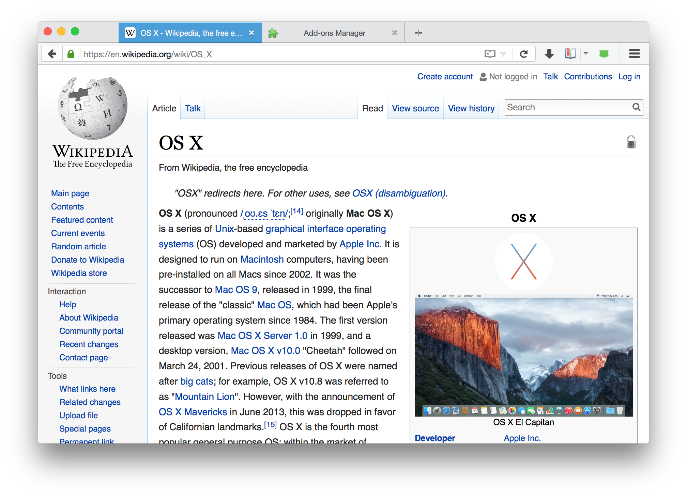
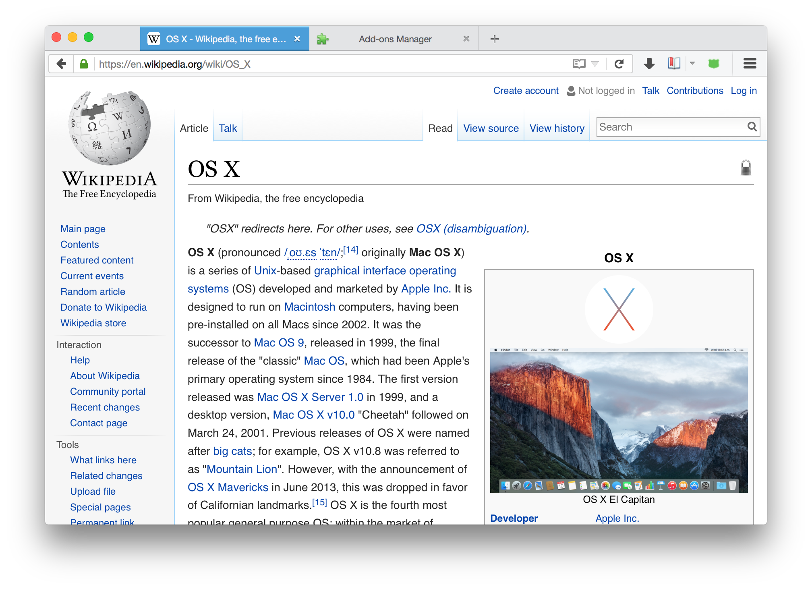

# firefox-osx-font-smoothing

Enables OS X font smoothing in Firefox by default, which looks way better.

# Before

# After

# Requirements 
Requires OS X + Firefox (obviously). Best results with Retina devices. You may want to use addons such as [Stylish](https://addons.mozilla.org/en-GB/firefox/addon/stylish/) to conveniently change default CSS.

# CSS
[osx-font-smoothing.css](osx-font-smoothing.css) - it's trivial.